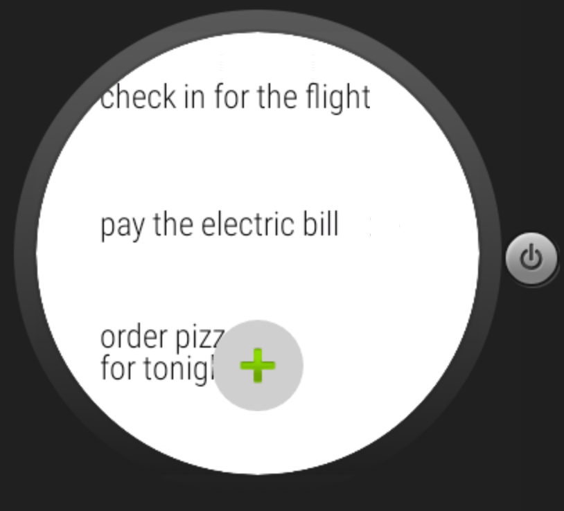

#  Android Wear Lab

## Introduction

> ***Note:*** _This can be a pair programming activity or done independently._

This lab is going to give you some more experience writing an Android Wear app, while also introducing you to a new part of Wear. You will be writing an app that allows you to take notes using your voice, and display them in a list on the Wear device. You can find out how to add voice input to your Wear app [at this link.](http://developer.android.com/training/wearables/apps/voice.html#FreeFormSpeech)

The user should be able to press a button to bring up the voice prompt, and the text they say should be stored in the list after they're finished speaking.

## Exercise

#### Requirements

- Allow the user to use voice input
- Show new entries on the list
- Scroll through all previous notes

**Bonus:**
- Add a voice prompt to open the app
- Display the notes in a format other than a list (ie cards)

#### Starter code

No starter code is provided, but you can refer to code from the lesson if needed.

#### Deliverable

A **Wear** app that meets the requirements above.

## Additional Resources

- [Adding Voice Capabilities](http://developer.android.com/training/wearables/apps/voice.html#FreeFormSpeech)
